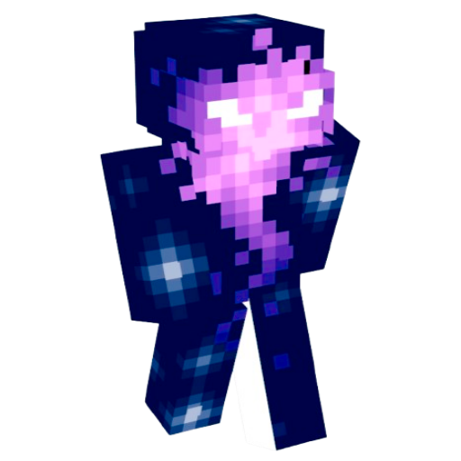

# Cartoon Filter Web App

A simple yet stylish web application that transforms your photos into cartoon-style images using computer vision techniques.



## Features

- 📷 Upload your own photo  
- 🌀 Applies Gaussian blur + edge detection to cartoonify images  
- 🎇 Firework animation on result generation  
- 🌫️ Glassmorphism UI with smooth interactions  
- 📥 Download cartoon image in PNG / JPEG / WEBP  

## Tech Stack

| Frontend | Backend | Others        |
|----------|---------|---------------|
| React    | FastAPI | OpenCV (cv2)  |
| Axios    | Python  | CSS Animations|

## Backend Instructions

```bash
cd backend
pip install fastapi uvicorn opencv-python python-multipart
uvicorn main:app --reload

## Frontend Instructions

```bash
cd frontend
npm install
npm start


